# IntelliFlow: Advanced RAG & Agentic AI Framework

[](https://www.python.org/downloads/release/python-380/)
[](https://streamlit.io)
[](https://langchain.ai/docs/langgraph)
[](https://github.com/pgvector/pgvector)

**IntelliFlow** is a powerful and scalable framework for Retrieval-Augmented Generation (RAG) and Agentic AI. This is not just a simple Q&A bot; it's a sophisticated system featuring a **dynamic workflow, self-correcting capabilities, and the ability to use tools**.

The project is powered by **LangGraph**, implementing a complex, cyclical reasoning process. This allows the agent to **analyze, rewrite, route, retrieve, generate, and finally, reflect** on the quality of its output. If an answer is subpar, the agent automatically refines its search strategy and retries, ensuring a higher quality final response.


*(A short GIF demonstrating the UI and features is highly recommended here)*

## ✨ Core Features

- **🧠 Advanced Agentic Workflow (Powered by LangGraph)**:
  - **Query Analysis**: Automatically identifies the user's intent (e.g., knowledge query, weather request, or general chat).
  - **Adaptive Query Rewriting**: Optimizes the user's input for better retrieval. In the retry loop, it uses targeted suggestions to refine the query, rather than just appending text.
  - **Dynamic Routing**: Intelligently dispatches tasks to the document retriever, external tools, or a direct generation module based on the query type.
  - **Reflection & Self-Correction**: After generating an answer, the agent evaluates its quality. If deemed insufficient, it generates **concrete suggestions on how to improve the search query** and enters a retry loop.

- **📚 Intelligent RAG Pipeline**:
  - **Threshold + Top-K Hybrid Retrieval**: First, it attempts to retrieve documents above a specific similarity threshold. If none are found, it automatically **falls back** to returning the top-K most similar documents, ensuring you always get the most relevant context available.
  - **Persistent Vector Store**: Utilizes **PostgreSQL + pgvector** as an enterprise-grade vector database that is stable, reliable, and scalable.
  - **Multi-Format Support**: Natively handles PDF and TXT document uploads.

- **🛠️ Extensible Tool Integration**:
  - Comes with a built-in **real-time weather query tool** (using the Amap API) to showcase the agent's ability to interact with the outside world.
  - The framework is designed for easy extension with more custom tools (e.g., calculators, search engines, API callers).

- **🔍 Transparent Reasoning Process**:
  - Users can opt to view the AI's "thinking process" in real-time. This enhances trust and provides invaluable insights for debugging and optimization.

- **🚀 Modern & Scalable Tech Stack**:
  - **Backend**: Python, LangChain, LangGraph
  - **Frontend**: Streamlit
  - **Database**: Dockerized PostgreSQL + pgvector
  - **Configuration**: Pydantic
  - **Dependency Management**: `pyproject.toml`

## 🏛️ System Architecture

IntelliFlow's workflow is a cyclical graph, enabling complex reasoning and self-improvement. The key innovation is in the "Reflection" to "Rewrite" loop, where targeted suggestions—not the original query—guide the refinement process.

```mermaid
graph TD
    A[User Input] --> B{IntelliFlow Agent};
    B --> C[Step 1: Analyze Query];
    C --> D[Step 2: Rewrite Query];
    D --> E{Step 3: Intelligent Routing};
    E -- Knowledge Query --> F[📚 Smart Retrieval];
    E -- Weather Query --> G[🛠️ Weather Tool];
    E -- General Query --> H[🧠 Direct Generation];
    F --> H;
    G --> H;
    H --> I[Step 4: Generate Response];
    I --> J[Step 5: Quality Reflection];
    J -- Poor Quality & Retries Left --> K[Generate Refinement Suggestions];
    K --> D;
    J -- Good Quality or No Retries Left --> L[✅ Final Output];
    L --> M[User Interface];

    style K fill:#f9f,stroke:#333,stroke-width:2px
```



## 🚀 Quick Start

### Prerequisites
- Python 3.8+
- Git
- [Docker](https://www.docker.com/get-started) and Docker Compose

> **Note for Windows Users**: Docker Desktop on Windows requires **WSL 2 (Windows Subsystem for Linux 2)** to function correctly. Please ensure you have [installed and enabled WSL 2](https://learn.microsoft.com/en-us/windows/wsl/install) before proceeding.

### 1. Clone the Repository
```bash
git clone https://your-repository-url.git
cd IntelliFlow
```

### 2. Configure Environment Variables
Copy the example environment file. You will need to fill in your API keys.
```bash
cp .env.example .env
```Now, edit the `.env` file with your Alibaba Cloud (for DashScope models) and Amap API keys:```env
# .env
ALI_API_KEY="sk-your-alibaba-cloud-api-key"
AMAP_API_KEY="your-amap-api-key"
# Other settings can be left as default
```

### 3. Launch the Database
Start the PostgreSQL + pgvector service in the background using Docker Compose.
```bash
docker-compose up -d
```
On the first run, this command will automatically download the image, create the database, and initialize the tables and extensions according to `init.sql`.

### 4. Install Dependencies
It is highly recommended to use a virtual environment.
```bash
# Create a virtual environment
python -m venv venv

# Activate the virtual environment
# On macOS / Linux:
source venv/bin/activate
# On Windows:
venv\Scripts\activate

# Install all dependencies in editable mode
pip install -e .
```
*(Using `-e .` installs the project in editable mode, which is convenient for development.)*

### 5. Run the Application
You're all set! Launch the Streamlit application.
```bash
streamlit run src/app.py
```
Open your web browser and navigate to `http://localhost:8501` to start interacting with IntelliFlow.

## 🔬 Testing & Debugging

This project includes a comprehensive testing and debugging suite to ensure reliability and visualize the agent's behavior.

### 1. Install Testing Dependencies
```bash
pip install -r test/requirements_test.txt
```

### 2. Run the Full Test Suite
This script will execute a series of predefined queries, log their detailed execution flow, and generate a `intelliflow_test_report.json` in the `test_outputs` directory.
```bash
python test/test_graph.py
```

### 3. Debug a Specific Query
Use this script for a step-by-step analysis of how the agent's state changes for a single query.
```bash
python test/debug_graph.py
```

## 📖 Project Structure
```
IntelliFlow/
├── .env              # Stores API keys and config (created by you)
├── docker-compose.yml # Docker config for launching the database
├── init.sql          # Database initialization script
├── pyproject.toml    # Project metadata and dependency management
├── src/
│   ├── agents/       # LangGraph agent definitions (graph, nodes)
│   ├── config/       # Application configuration (Pydantic)
│   ├── database/     # DB connection, models, and vector store logic
│   ├── tools/        # External tools (weather, document processor)
│   ├── utils/        # Helper utilities (decorators, UI, chat history)
│   └── app.py        # Streamlit application main entry point
├── test/             # Testing and debugging scripts
└── README.md         # The file you are reading
```

## 💡 Future Directions
- [ ] **Integrate More Tools**: Add a web search tool (e.g., Tavily), a calculator, or a code interpreter.
- [ ] **Support More Document Types**: Add support for Word, Markdown, and HTML files.
- [ ] **Session Management & Multi-tenancy**: Provide isolated sessions and document stores for different users.
- [ ] **Frontend Enhancements**: Explore more complex UI interactions and visualizations.
- [ ] **Model Evaluation Framework**: Build a robust evaluation suite to test the performance of different models and prompting strategies.